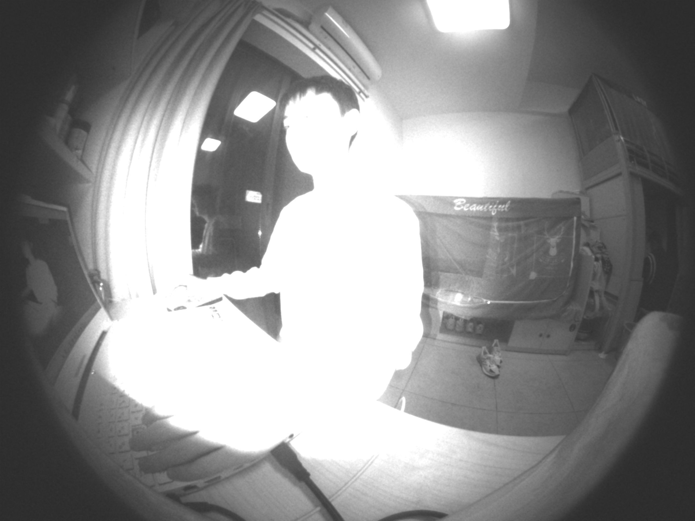
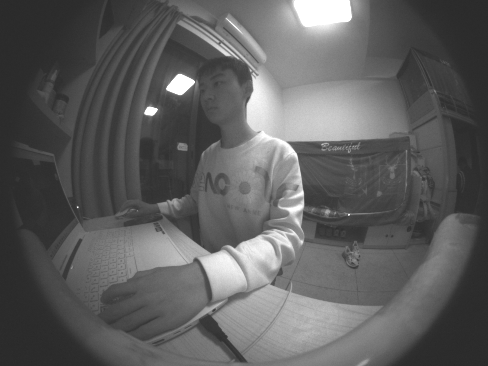

# EXTENDING FAST-OPENISP TO RGB-IR SENSORS

## Project Overview
"The project adds a new module FGP, short for 'FINAL GRAPHICS PROJECT,' which allows fast-openISP to handle RGB-IR (Red-Green-Blue-Infrared) image data."

>"Special thanks to the creator of the fast-openISP, [Qiu Jueqin](https://github.com/QiuJueqin). The library served as the foundation for the module enabling the handling of RGB-IR image data."

## FGP module
The module references this paper [here](https://ieeexplore.ieee.org/document/10043554). It changes the RGB-IR image data into a format compatible with the existing fast-openISP pipeline and lets it handle the rest. Additionaly, it also performs guided-upsampling on the IR values to generate a grayscale image.

### BGGR Conversion
The transformation consists of three steps. First, it replaces all the IR values with the average of the nonzero surrounding red values, provided that the surrounding reds in question are one unit away; otherwise, the IR value remains unchanged. Next, it replaces all the R values with the average of the nonzero blues that are two units away. Finally, it retrieves the original IR values, performs upsampling, and subtracts them from the modified image to balance it.

#### IR to R Conversion Implementation Strategy
The IRs follow a specific pattern. Half of the IRs have reds as their bottom-left and top-right neighbors, leaving the opposite for the other half. So, the strategy is to first build numpy boolean filters (or mask if you will) with the shape of the halves and use numpy.where to get numpy array of neighboring red values or zeroes, with each filter representing a position of the reds, be it top-left, top-right, bottom-left, or bottom-right. 
```python
    # gets the array for bottom-left red neighbors.
    f_l = np.where(f_l_cond, source_copy[f_indices[:, 0] - 1, 
    					# true, false values
    					f_indices[:, 1] + 1], 0)
```
After, use the four arrays to calculate the average of the nonzero neigbors and use numpy.put to put them back in the original array in their respective positions.
```python
    # sums two of the arrays and take the average of the nonzero neighbors.
    f_sum = f_l + f_r
    f_count = f_l_cond.astype(int) + f_r_cond.astype(int)
    
    # updates the source image.
    source.put(np.ravel_multi_index(f_indices.T, source.shape), f)
```

##### Handling IR with no R neigbours
Due to the pattern it follows, there is only one IR without a red neighbour. So, the value for that particular position is set to be the value of the original IR.
```python
    f[f == 0] = source[-1, -1]
```
Here,  the value is updated before the array mentioned earlier gets inserted into the image.

##### Complications
numpy.where ran into some out of bounds index issue at or near the edges of the image data. So, numpy.pad was used to resolve it.
```python
    # padding to solve index out of bound issue with np.where
    source_copy = np.pad(source, (0, 1), mode='constant')
```

#### R to B Conversion Implementation Strategy
The conversion uses the same strategy as the IR-to-R conversion strategy. It creates boolean filters the size of the number of reds and populates them with the blue values of the corresponding position, averages it, and puts it back to the source using numpy.where and numpy.put.

#### IR Subtraction
In some cases, the infrared channel may introduce color imbalances or distortions in the RGB image. So, to achieve better color fidelity in the resulting RGB image, we subtract the IR channel multiplied by a constant value to correct these imbalances.

##### Implementation Strategy
The general idea is to obtain all the values of the IR by index slicing and then perform upsampling by a factor of two to match the shape of the image. After, create three copies and multiply each `numpy.ndarray` by their respective constants, filter using `numpy.where`, and subtract from source.
```python
    # boolean filter for red.
    r_filter = self.new_truth_table(self.get_new_base_table("n_r"))
    # multiplying by constant; q_source is the upsampled IR array.
    r_q = r_const * q_source
    # filter using numpy.where.
    r = np.where(r_filter, r_q.astype(np.uint32), 0)
    
    # update source image.
    source -= r
```

#### Guided Upsampling
Guided upsampling is a technique used to increase the resolution or size of an image while preserving its details and reducing artifacts. The goal of guided upsampling is to generate a high-quality, visually pleasing image that appears as if it was originally captured at the higher resolution. 

##### Implementation Strategy
The implementation is fairly simple. First, smooth out the reference image using a gaussian filter from `scipy.ndimage`. After, get the high-frequency noise back by subtracting the smoothed out guide image with the upsampled IR image. Lastly, add those high frequency noise back to the upsampled source image.
```python
    # smooths out source image by removing (well, reducing) high frequency noise.
    # change standard deviation to control the amount of smoothing/blurring.
    smooth_guide = gaussian_filter(reference, standard_deviation)
    # removes the smoothed source from the reference image.
    # in other words, keep only the high frequency noise that was removed in the
    # blurring process earlier to add back to source image for guided upsampling.
    some_details = smooth_guide - source
    return source + some_details
```
Note that for the code snippet above, source refers to the upsampled IR array.

### Running the Demo
To run the `demo.py` file, do the following two steps:

1. Install the dependencies.
```bash
    pip install -r requirements.txt
```
2. Run the python file.
```bash
    python demo.py
```
Note that you can change the parameters by editing the `.yaml` file.

### SAMPLE RESULTS
These are sample images generated using a custom config file.

|  |  |
|:---:|:---:|
|  |  |

The first row are outputs from 1_1.raw, while the second, 2_1.raw.
